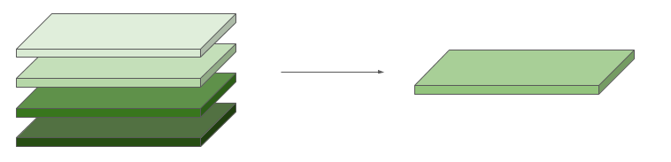

---
title: "Math with Images"
teaching: 25
exercises: 10
questions:
- "What is a reducer and why is it mind-blowing?"
objectives:
- "How do I do operations on stacks of images?"
- "Load datasets and successfully visualize in the GEE API"
- Map a function over an image collection
- "Use a reducer to calculate mean slope over an area"
keypoints:
- Reducers take an input dataset and produce a single output. 
--- Never use for-loops in GEE, instead map functions over image collections.
 --- You can't make publication quality images in GEE yet, but visualization functionality is always expanding.
 

- Math with Images 
--- 

Some calculations are very easy to extract because they rely on built in functions. 

	// Print the number of watersheds.
	print('Count: ', watersheds.size());

Slope is another one

	var slope = ee.Terrain.slope(elevation); 
	var visslope = {min:0, max:10, palette:['00ff00',"ff0000"]};
	Map.addLayer(slope.clip(pugetSound),visslope,"slope");

You can also do simple band math using operators. 

#### Using Reducers

Sometimes we need to do more complex calculations over many features or images. To do this, we use **reducers**.	

* Reducers aggregate data over some dimension
	* time (imageCollection.reduce()), 
	* space (image.reduceRegion(), image.reduceNeighborhood()), 
	* bands (image.reduce()), 
	* or the attribute space of a FeatureCollection (featureCollection.reduceColumns()  
* Reducers have inputs and a single output.
* Reducers aggregate based on the specified statistic (mean, min, standard deviation) or more complex constructions (linear regression, histogram).

#### Reducing a Feature Collection Using Summary Statistics
	
What are the summary statistics for the area of our US watersheds?
This argument goes to "AreaSqKm" column of watersheds feature collection and gives you an aggregate statistics for all the watersheds in the collection

	// Print stats for an area property.
	print('Area stats:', watersheds.aggregate_stats('AreaSqKm'));

#### Reducing Over a Region

What is the average slope for the Puget Sound Region? 

	// Reduce the region. The region parameter is the Feature geometry.
	var meanElevation = elevation.reduceRegion({
  		reducer: ee.Reducer.mean(),
  		geometry: pugetSound.geometry(),
  		scale: 30,
 		 maxPixels: 1e9
	});

	// The result is a Dictionary. Print it.
	print('mean elevation:', meanElevation);

Now we want to visualize our new layer. Let's define a lovely palette and map our image.

	//define vis parameters
	var palette=  ["66ffff","00ff00", "ffff00", "ff3300", "ff0000"];  

	//add precip to the map
	Map.addLayer(annualPrecip, {min:900, max: 2000, palette: palette}, "Annual Precip"); 

#### Reducing an Image Collection Time Series to One Value

Gridmet data is a stack of images where each image is a day. 
Let's calculate the total annual precipitation by summing all 365 days to one number. 
	
// FIX THIS SO IT IS ACUTALLY USING A REDUCER
	var annualPrecip = ee.Image(ee.ImageCollection('IDAHO_EPSCOR/GRIDMET').filterDate
	('2015-01-01', '2015-12-30').select("pr").sum())  
	Map.addLayer(annualPrecip, {}, 'Annual Precip') 
